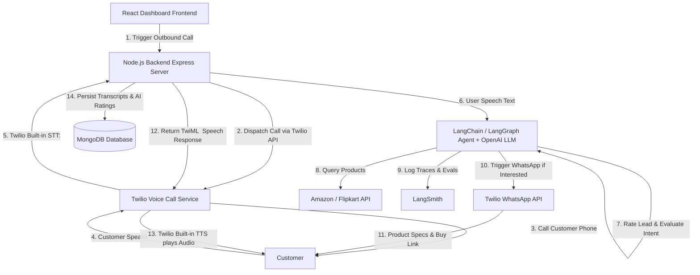

# Implementation Plan & System Architecture

## AI Telephony Sales & Product Recommendation Agent

Build a full-stack, AI-powered interactive voice call system that calls users, conducts an interactive conversation about products using **LangChain** and **LangGraph**, rates conversation quality and lead sentiment via **OpenAI**, traces & evaluates agent execution with **LangSmith**, handles phone calls & instant WhatsApp follow-ups via **Twilio**, connects to an **E-Commerce API (Amazon/Flipkart)** for live product information, stores call records in **MongoDB**, and provides an interactive management dashboard built with **React**.

---

## 🏗️ Architecture Overview



---

## 🎙️ How Voice Processing Works (STT & TTS)

1. **Voice-to-Text (Speech-to-Text / STT)**:
   - **Twilio `<Gather input="speech">`**: Twilio automatically listens to customer voice over the phone line, transcribes it to text in real-time using neural speech recognition, and posts `SpeechResult` to our Node.js backend.

2. **Text-to-Voice (Text-to-Speech / TTS)**:
   - **Twilio `<Say voice="...">`**: When our LangGraph agent generates a text response (powered by OpenAI `gpt-4o` / `gpt-4o-mini`), our backend returns TwiML containing `<Say voice="Polly.Joanna-Neural">` (or Indian-English `Polly.Aditi`). Twilio converts text into natural human speech dynamically on the call.

3. **Underlying LLM & Conversation Rating**:
   - **OpenAI (`gpt-4o` / `gpt-4o-mini`)**: Powers conversation logic inside **LangGraph**, driving product search, interest detection, AI lead rating (1–5 Star score), and WhatsApp tool calls.

---

## 📂 Project Structure

```
ai-telephony-sales-agent/
├── IMPLEMENTATION_PLAN.md        # Complete Architecture & System Design Specs
├── README.md                     # Setup, Configuration & Operating Instructions
├── .gitignore
├── backend/
│   ├── config/
│   │   └── db.js                 # MongoDB Mongoose Connection (with fast timeout fallback)
│   ├── models/
│   │   └── CallLog.js            # MongoDB schema for call transcripts, AI ratings & WhatsApp flags
│   ├── agent/
│   │   └── salesAgent.js         # LangGraph StateGraph, OpenAI LLM & AI Evaluator Node
│   ├── services/
│   │   ├── ecommerceService.js   # Amazon / Flipkart API product lookup service
│   │   └── twilioService.js      # Twilio Voice call trigger & WhatsApp sender
│   ├── routes/
│   │   ├── apiRoutes.js          # Express API for frontend dashboard & browser simulator
│   │   └── twilioWebhooks.js     # TwiML Voice Webhooks (<Gather input="speech">)
│   ├── test_agent.js             # Standalone local test runner
│   ├── server.js                 # Express backend server entry point
│   ├── .env                      # Environment credentials file
│   └── package.json
└── frontend/
    ├── src/
    │   ├── App.jsx               # React Sales Dashboard & Interactive Speech Console
    │   ├── index.css             # Styling & Tailwind setup
    │   └── main.jsx
    ├── index.html
    ├── vite.config.js
    └── package.json
```

---

## 🛠️ Verification & Test Plan

1. **Automated Graph & Evaluator Tests**:
   - Run `node backend/test_agent.js` to simulate speech inputs, AI lead rating (1-5 ⭐), product fetching, and WhatsApp tool dispatches.
2. **Frontend Production Build Test**:
   - Run `npm run build` inside `frontend/` to verify zero JSX or Vite bundling errors.
3. **End-to-End Live Call Verification**:
   - Expose backend port 5000 via Ngrok (`ngrok http 5000`).
   - Trigger call from React Dashboard and answer on mobile phone.
