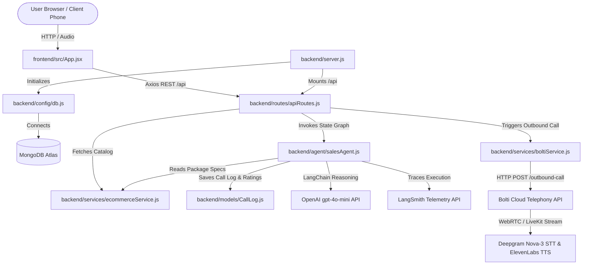

# ⚡ PitchBolt — AI Telephony Sales & Lead Qualification System

**PitchBolt**: Fast-paced AI Voice Agent matching quick on-call action and dispatch engine. Built with **LangChain**, **LangGraph**, **OpenAI**, **Bolti AI Voice Engine**, **MongoDB**, and **React**.

> **Repository**: [Gunjapalle-Suma-Bhavya/ai-voice-recommendation-system](https://github.com/Gunjapalle-Suma-Bhavya/ai-voice-recommendation-system)  
> **Author & Contributor**: Gunjapalle-Suma-Bhavya  

---

## 🌟 Key Features

- **LangGraph Conversational Agent**: Multi-turn sales flow supporting English (priority), Telugu, and Hindi speech.
- **E-Commerce Web Development Sales**: Pitches Starter (₹19,999), Growth Pro (₹49,999), and Enterprise (₹99,999) packages.
- **4-Point Discovery Questionnaire**: Asks about products to sell, target launch timeline, allocated budget, and required features.
- **Real-Time Lead Rating**: Evaluates buyer seriousness score (1 to 5 Stars) and categorizes leads as **Hot**, **Warm**, or **Cold**.
- **On-Call Action Engine**: Takes on-call action (locks in strategy session & proposal scope) when high intent is detected.
- **Named Callback Booking**: Extracts named callback times (e.g. *"Call me tomorrow at 4 PM"*) and books the callback session.
- **Contextual WhatsApp Summary**: Generates and dispatches WhatsApp summaries with exact requirements discussed and proposal link.
- **Minimalist React Dashboard**: Minimalist UI with live call dispatch, interactive speech console, and lead qualification table.

---

## 🔗 File Connections ("What Connects to What")



### Modular Linkage Breakdown Table:

| File Name | Imports / Connects To | Role & Responsibilities |
|---|---|---|
| [`server.js`](file:///C:/Users/Shanmukha%20Tharun/ai-voice-recommendation-system/backend/server.js) | `dotenv`, `express`, `cors`, [`config/db.js`](file:///C:/Users/Shanmukha%20Tharun/ai-voice-recommendation-system/backend/config/db.js), [`routes/apiRoutes.js`](file:///C:/Users/Shanmukha%20Tharun/ai-voice-recommendation-system/backend/routes/apiRoutes.js) | Starts Node.js Express server on port 5000, connects to MongoDB, and registers `/api` REST routes. |
| [`config/db.js`](file:///C:/Users/Shanmukha%20Tharun/ai-voice-recommendation-system/backend/config/db.js) | `mongoose` | Establishes the database connection to MongoDB Atlas cluster. |
| [`models/CallLog.js`](file:///C:/Users/Shanmukha%20Tharun/ai-voice-recommendation-system/backend/models/CallLog.js) | `mongoose` | Defines collection schema for call SID, client number, transcript, buyer rating (1-5 ⭐), callback time, and WhatsApp text. |
| [`services/ecommerceService.js`](file:///C:/Users/Shanmukha%20Tharun/ai-voice-recommendation-system/backend/services/ecommerceService.js) | None (Standalone Data Module) | Provides E-Commerce Website Development Service Packages catalog (Starter, Growth Pro, Enterprise) and search lookup. |
| [`services/boltiService.js`](file:///C:/Users/Shanmukha%20Tharun/ai-voice-recommendation-system/backend/services/boltiService.js) | `axios` | Sends POST requests to Bolti's REST API (`/workspaces/{id}/agents/{id}/outbound-call`) using account JWT authorization. |
| [`agent/salesAgent.js`](file:///C:/Users/Shanmukha%20Tharun/ai-voice-recommendation-system/backend/agent/salesAgent.js) | `@langchain/openai`, `@langchain/langgraph`, [`services/ecommerceService.js`](file:///C:/Users/Shanmukha%20Tharun/ai-voice-recommendation-system/backend/services/ecommerceService.js), [`models/CallLog.js`](file:///C:/Users/Shanmukha%20Tharun/ai-voice-recommendation-system/backend/models/CallLog.js) | Core PitchBolt AI brain. Executes 2-node LangGraph state graph (`action_node` $\rightarrow$ `sales_node`), evaluates buyer intent (1-5 ⭐), extracts callback times, and formats WhatsApp summaries. |
| [`routes/apiRoutes.js`](file:///C:/Users/Shanmukha%20Tharun/ai-voice-recommendation-system/backend/routes/apiRoutes.js) | `express`, [`services/boltiService.js`](file:///C:/Users/Shanmukha%20Tharun/ai-voice-recommendation-system/backend/services/boltiService.js), [`services/ecommerceService.js`](file:///C:/Users/Shanmukha%20Tharun/ai-voice-recommendation-system/backend/services/ecommerceService.js), [`agent/salesAgent.js`](file:///C:/Users/Shanmukha%20Tharun/ai-voice-recommendation-system/backend/agent/salesAgent.js), [`models/CallLog.js`](file:///C:/Users/Shanmukha%20Tharun/ai-voice-recommendation-system/backend/models/CallLog.js) | Defines REST routes for frontend interaction: `/calls/trigger`, `/calls/simulate-speech`, `/calls`, `/products/search`. |
| [`frontend/src/App.jsx`](file:///C:/Users/Shanmukha%20Tharun/ai-voice-recommendation-system/frontend/src/App.jsx) | `react`, `axios`, `lucide-react` | PitchBolt Minimalist Enterprise Dashboard UI. Displays call trigger form, active package specifications, live voice console, lead ratings, booked callback alerts, and WhatsApp summary cards. |

---

## 🛠️ Architecture Stack

- **Speech-to-Text (STT)**: Deepgram Nova-3 via Bolti
- **Text-to-Speech (TTS)**: ElevenLabs via Bolti
- **Voice Transport**: LiveKit WebRTC
- **AI Agent & Reasoning**: LangGraph & OpenAI (`gpt-4o-mini`)
- **Backend**: Node.js & Express (Port 5000)
- **Frontend**: React & Vite with Tailwind CSS (Port 3000)
- **Database**: MongoDB Atlas

---

## 🚀 Quick Start

### 1. Environment Configuration
Create `backend/.env` with your API credentials:

```env
PORT=5000
MONGODB_URI=mongodb+srv://...

# OpenAI Credentials
OPENAI_API_KEY=sk-...

# Bolti AI Voice Credentials
BOLTI_API_KEY=eyJ...
BOLTI_WORKSPACE_ID=23172290-fab3-40f7-bd08-c49129bfa6a5
BOLTI_AGENT_ID=b009b044-e9e4-4e09-8f34-a7b143f40a65
BOLTI_BASE_URL=https://api.bolti.co.in
```

### 2. Start Backend
```bash
cd backend
npm start
```

### 3. Start Frontend
```bash
cd frontend
npm run dev
```
Open **`http://localhost:3000`** in your browser.
